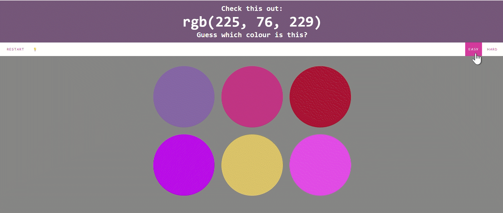

###### Belows are my instructions and notes for every user (*player*)  who wants to know more.

# RGB Colour Guessing Game

Hi, welcome to my **"RGB Colour Guessing"** game.

Yes, this time it's a game indeed! And of course, it's fun to play...

> ##### **"Enough! We have already seen these sentences in your game, can you show something new here?"**

Alright, **new stuffs**: 

## Features

###### Since I have already provided the tips/hints for playing this game, I will leave something different here...

After playing this game, you will learn :

1. What is a **"RGB Colour Space"**.
2. What does **each value** in RGB Colour Space represent. 
3. What happen **when value changes** in RGB Colour Space.
4. How does this info **useful for** learning **coding**.

> ###### Note: *Not everything was shown in the `Hint`, especially for reading RGB Colour Space, you have to explore all possible scenarios yourself. (Because the space for writing hints in the game is not enough...)*

## Installation

You do not need to install anything to run this game demo, just click on the link given [here](https://2h-5.github.io/rgb-colour-guessing/). Do not worry, this link is not malicious as I deployed it using **GitHub Pages**.

> ###### Warning: *For better user experience, please open this web app using your computer instead of smartphone...* 

## Stories Behind the Work

This is my first individual **Svelte** project, the basic idea was from one of my university courses —— Scripting Programming Language.

However, I further extended more functionalities based on original university project, such as *different interaction, game modes, etc*. 
(Which I will talk a bit more about **iterations** through each prototype in different `branches`.)

And this should make this project unique enough from I have done previously. *(Hopefully...)*

## Screenshots

