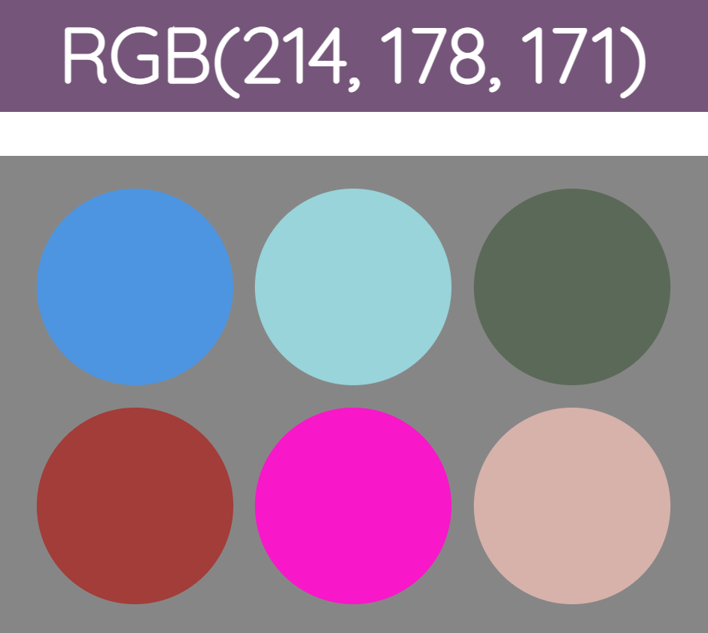

# RGB Colour Game (Prototype #1)

## Features (What Was Built)

1. Display a random RGB colour space in a new round.
2. Provide 6 random colour palettes.
3. Prompt messages for correct and incorrect choices.
4. Enable new rounds for restarting or playing again.

## Installation

1. Download the zip folder:
```
<> Code → Download ZIP
```
2. Unzip the zip folder on your computer 

###### (This is a sample step, it may be differ based on your zipping software...)

```
*Right click* → Extract All...
```
3. Go into the extracted folder, find "index.html".
4. Double-click it to open on your browser.
5. Enjoy! (Probably not that enjoyable compared to my final version...)

## Stories Behind the Work

The "game" idea was actually based on part of the assignments from one of my university courses —— Scripting Programming Language.

That course is teaching us basics of web programming, including how to build a static web using plain HTML + CSS + JavaScript.

However, I think that assignment was kind of *"naive"* as it was a second-year level difficulty, thus I decided to build more functionalities towards the final version.

## Screenshots

