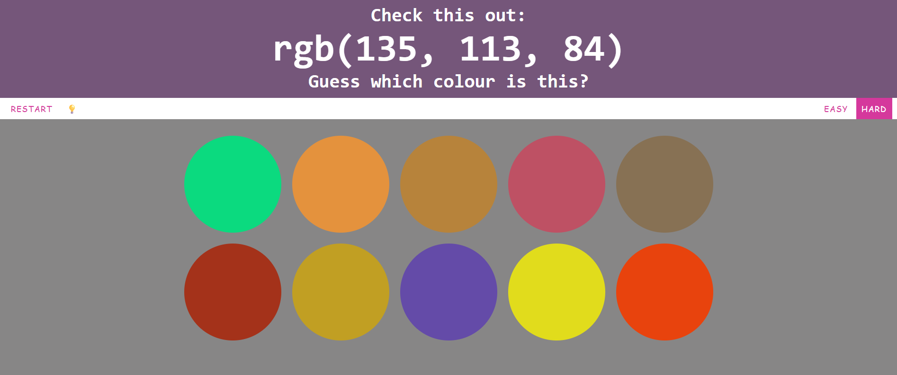

# RGB Colour Game (Prototype #2)

## Features (Compared to Prototype #1)

###### Every new feature I added in Prototype #2 applied different coding logic from Prototype #1, which involved a lot of work, and makes this project to be quite different from my University project.

1. Provide **two** different **game modes** for users to choose. *(You get more colour palettes in "Hard" mode.)*
2. Add a "light" **hint** button beside "Restart/Play Again" button. *(Explain how to read RGB colour space effectively.)*
3. **Fix the problem** of game mode button squeezed out of the navigation bar due to different text length of "Restart/Play Again" button.
4. Add **reference link** at the bottom.

## Installation

###### (Very similar installation guide to Demo 1.)

1. Download the zip folder:
```
<> Code → Download ZIP
```
2. Unzip the zip folder on your computer 

###### (This is a sample step, it may be differ based on your zipping software...)

```
*Right click* → Extract All...
```
3. Go into the extracted folder, find "index.html".
4. Double-click it to open on your browser.
5. Enjoy! (Probably not that enjoyable compared to my final version...)

## Screenshots

